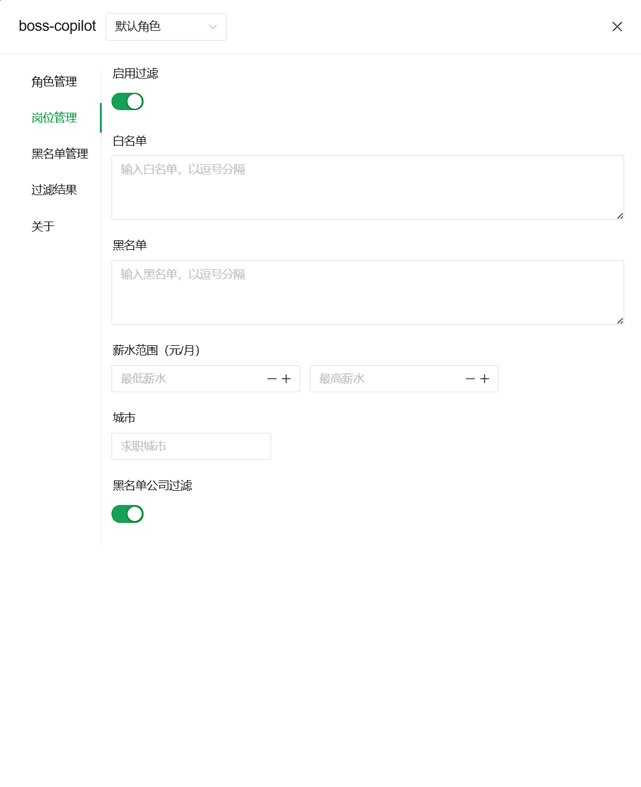

# boss-copilot

最初这个项目的诞生是源于自己找工作用boss直聘的时候想筛选掉一些外包公司，但是随着boss直聘的改版，以及当下求职的时候更多的时候是对岗位的过滤，反而导致最初的功能更不上时代了，所以有了这次新版本的全新的迭代。

当然也介绍下，本次也对项目重新命名了，copilot是最新AI助手非常流行的一个词，希望这个插件也向助手一样来帮助着你。

## 功能介绍

本次迭代引入了多角色的概念，同时功能集中在了列表这一块。

1. 多角色，对于求职多个岗位的小伙伴应该很有帮助
2. 岗位，支持关键词过滤和筛选，以及薪水和城市的同时筛选
3. 黑名单公司，默认提供了一批常见外包公司，你也可以根据当前角色来对黑名单公司进行添加
4. 过滤结果，根据过滤的类型来对岗位进行归纳，方便浏览

## 其他

因为插件的运行机制是拦截xhr的请求，所以每次保存或者更改了配置项，都需要下一次请求才能触发。

## 协议

MIT License
